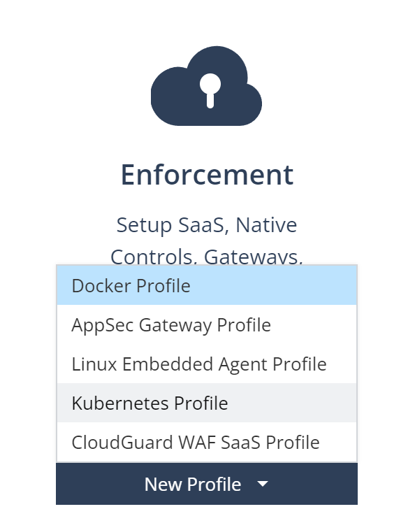

# Secure Kubernetes Ingress with CloudGuard WAF

## Deploy cluster with Kind

```shell
# workdir
cd /workspaces/k8s-playground/34-waf-ingress/

# will use Arkade package manager to get kind binary
# https://github.com/alexellis/arkade?tab=readme-ov-file#getting-arkade
curl -sLS https://get.arkade.dev | sudo sh

# get kind 
ark get kind
sudo mv /home/vscode/.arkade/bin/kind /usr/local/bin/
# get k9s
ark get k9s
sudo mv /home/vscode/.arkade/bin/k9s /usr/local/bin/

# now kind command exists
kind create cluster --config=kind-cluster.yaml
# our new cluster
kubectl cluster-info --context kind-kind

# shortcut
alias k=kubectl

# what we have got
kubectl get no -o wide
# pods
kubectl get po -o wide -A
```

Summary: we have got running Kubernetes cluster in Codespace, no ingress installed yet.

## Install CloudGuard WAF Ingress Controller

We will combine open-appsec helm chart with CloudGuard WAF management and images.
Reference: 
* [open-appsec Kubernetes deployment](https://docs.openappsec.io/getting-started/start-with-kubernetes/install-using-helm-ingress-nginx-and-kong)
* Infinity Portal [CloudGuard WAF](https://portal.checkpoint.com/dashboard/appsec#/waf-policy/getting-started)

If you do not have Infinify Portal tenant with CloudGuard WAF, simply [register](https://portal.checkpoint.com/register/) for free CloudGuard WAF management tenant.

Create new WAF Profile of type "Kubernetes Profile"


Set profile name `kind-profile`, copy and note Authentication Token in your password vault and ignore deployment instructions.
Make sure to Publish and Enforce, so Token is active before we deploy.


```shell
# your token for deployment use
export CPTOKEN=cp-ce1a1026-210a-4bfc-9f20-e51d552445ab2bd70a93-cede-44af-9c06-c5cac28ebb10

# download helm chart
wget https://downloads.openappsec.io/packages/helm-charts/nginx-ingress/open-appsec-k8s-nginx-ingress-latest.tgz

# deploy WAF NGINX Ingress using helm
#  notice it depends on valid auth token in env var CPTOKEN!!!
helm install appsec open-appsec-k8s-nginx-ingress-latest.tgz \
--set appsec.mode=managed --set appsec.agentToken=$CPTOKEN \
--set appsec.image.registry="" \
--set appsec.image.repository=checkpoint \
--set appsec.image.image=infinity-next-nano-agent \
--set appsec.image.tag=latest  \
--set controller.ingressClass=public \
--set controller.ingressClassResource.name=public \
--set controller.ingressClassResource.controllerValue="k8s.io/public" \
--set appsec.persistence.enabled=false \
--set controller.service.externalTrafficPolicy=Local \
-n appsec --create-namespace

# expose on node's 30080 and 30443 that kinds maps to Codespace's 80/443
kubectl -n appsec patch svc appsec-open-appsec-k8s-nginx-ingress-controller --patch '{"spec": {"type": "NodePort"}}'
kubectl -n appsec patch svc appsec-open-appsec-k8s-nginx-ingress-controller --patch-file ingress-ports.json
kubectl -n appsec get svc appsec-open-appsec-k8s-nginx-ingress-controller
# check ns appsec
watch -d kubectl get all -n appsec
```

Summary: we have NGINX Ingress running secured by CloudGuard WAF, but no ingress defined and no WAF policy set.

## Define first ingress

```shell
# review defined ingress rule for http://127.0.0.1.nip.io pointing to external website http://ip.iol.cz
code first-ingress.yaml
# deploy it
kubectl create ns 1st-ingress
kubectl apply -n 1st-ingress -f first-ingress.yaml
```

Expected output:
```
service/ip-iol-cz created
ingress.networking.k8s.io/ip-iol-cz created
```

Test access via the ingress
```shell
# expected output is IP address of Codespace
curl http://127.0.0.1.nip.io/ip/
# direct access - same IP returned from server
curl ip.iol.cz/ip/

# no security is enforced however - still reaching the server
curl 'http://127.0.0.1.nip.io/ip/?q=cat+/etc/passwd'
```

Summary: we have working Ingress to rule served from Service representing external website, however no active CloudGuard WAF policy. It has to be fixed in CloudGuard WAF policy.


## CloudGuard WAF policy using web UI

Login to your Infinity Portal tenant with Kubernetes Profile. We will define new Web Application asset in Prevent Mode and assign it to `kind-profile`.
Let start at [Getting started](https://portal.checkpoint.com/dashboard/appsec#/waf-policy/getting-started) section.


Choose New Asset / Web Application
Name application: `127.0.0.1.nip.io`
Add front-end URL (1): `https://127.0.0.1.nip.io`
Leave upstream URL (2) empty as target service is decided in Kubernetes Ingress rule.


In demo environment we choose Prevent, but typical approach would be start with Learning and Detect.


Choose existing `kind-profile` in Platform step.


Finish rest of wizard with default values and make sure to Publish and Enforce new policy.

Confirm your installed agent and check how latest policy is fetched in [Agents section](https://portal.checkpoint.com/dashboard/appsec#/waf-policy/agents?status=Connected&tab=general).


Once agents enforce latest policy with Prevent for `http://127.0.0.1.nip.io` we may revisit the site and cause some incident.

```shell
# simulate SQL injection
curl 'http://127.0.0.1.nip.io/ip/?q=UNION+1=1'
```

You will get security incident User Check page instead of real application data. Lets visit incident in logs:


Summary: We have working secured ingress into our application, but we had to create Ingress rule in Kubernetes and application web asset in CloudGuard WAF UI. Is there some way to automate web asset creation to automate full deployment including security policy?

## Automation of secure ingress rule and WAF policy

- work in progress