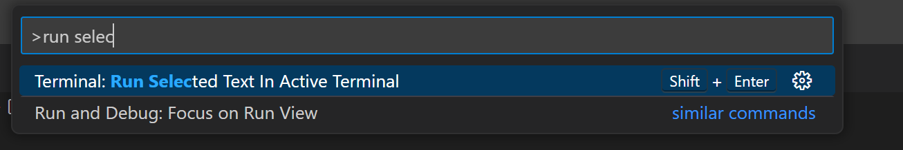

# k8s-playground

### Tutorial and experiments around containers.


Designed to be run in GitHub Codespace:

```shell
# follow Docker path
code ./01-docker/NOTES.md

# to follow Kubernetes path
code ./01-kubernetes/NOTES.md
```

### Hint: very useful keyboard shortcut:

